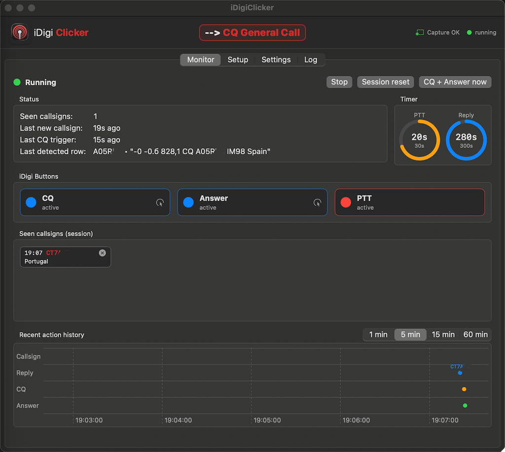

# iDigiClicker

> macOS auto-clicker for [iDigi](https://www.dl3lar.de/idigi.html) FT8 — watches the receive window via screen capture, doubleclicks newly decoded callsigns to call them automatically, and falls back to a synthetic CQ + Answer click whenever the band falls silent.



## What it does

- **Detects new callsigns.** Scans the iDigi receive area for green CQ lines with white text, OCR-extracts the callsign, and triggers a doubleclick on that row so iDigi starts replying.
- **Calls CQ when nothing happens.** If no answerable line shows up for a while, it clicks the **CQ** and **Answer** buttons in iDigi to invite a new contact.
- **Stays out of your way while transmitting.** While the **PTT** button is red (TX active), every callsign click is suppressed; a configurable cooldown after PTT release makes sure you don't talk over the next decoder cycle.
- **Tracks what it called.** Each clicked callsign is shown as a chip with the time, the callsign in red, and the DXCC entity (best-effort prefix lookup). You can remove a chip to call the same station again.
- **Headline action banner.** The most recent action (`Reply CALLSIGN · Country` or `CQ General Call`) slides in next to the logo so you can see at a glance what just happened.
- **Action timeline.** A live chart shows the last 1 / 5 / 15 / 60 minutes of detections, replies, CQs, and Answer clicks.

## Requirements

- **macOS 13 (Ventura) or newer**
- **iDigi** running with a visible receive window
- **Accessibility** permission (so the app can synthesise mouse clicks)
- **Screen Recording** permission (so the app can read the receive area)

The app itself does **not** talk to your radio. It only reads pixels and clicks where you tell it to inside iDigi.

## Install (release binary)

1. Download the latest `iDigiClicker.app.zip` from the [Releases page](../../releases).
2. Unzip and move `iDigiClicker.app` to `/Applications`.
3. The first launch is blocked by Gatekeeper because the binary is **not notarized**. Right-click the app → **Open** → confirm. (Or run `xattr -dr com.apple.quarantine /Applications/iDigiClicker.app` once.)
4. On first launch, macOS will ask for **Screen Recording** and **Accessibility** permissions. Grant both in *System Settings → Privacy & Security*. You may have to quit and reopen the app after granting.

## First-time setup

Open the **Setup** tab and teach iDigiClicker where the iDigi controls are:

1. **CQ button** — click *Learn position*, then click the iDigi CQ button. The app records the position, then auto-learns the active/inactive colors via a toggle dance (one synthetic click; ends in the original state).
2. **Answer button** — same procedure.
3. **PTT button** — only the position is needed. Color isn't learned because a synthetic click on PTT would actually transmit.
4. **Receive window** — click *Learn (2 clicks)*, then click the **top-left** and **bottom-right** corners of the iDigi receive list (without toolbar).

Once all four are set, switch to the **Monitor** tab and press **Start**.

## Settings

All timings live under the **Settings** tab:

- **Poll interval** — how often the app scans the receive window (ms).
- **Inactivity until CQ** — base inactivity timer; `searchInactivitySec` is an additional gate (see below).
- **Empty search before CQ** — minimum number of seconds without finding a callsign-bearing row in the receive window before CQ + Answer is allowed to fire. Both this **and** the inactivity timer have to expire.
- **Double-click delay** — gap between the two synthetic clicks of a doubleclick.
- **CQ → Answer delay** — pause between clicking CQ and clicking Answer.
- **Active-color learn — delay after click** — pause used by the toggle dance during color learning.
- **PTT cooldown after change** — hard gate: no callsign click for this many seconds after every PTT state change.
- **Click staleness override** — minimum delay between two consecutive callsign doubleclicks.
- **Green / White detection thresholds** — tune the pixel classification if your iDigi theme uses different shades.
- **Button probe** — sample rectangle around each button's click point for color matching.

## Build from source

```bash
git clone https://github.com/<you>/iDigiClicker.git
cd iDigiClicker
xcodebuild -project iDigiClicker.xcodeproj \
           -scheme iDigiClicker \
           -configuration Release \
           -derivedDataPath ./build \
           CODE_SIGN_IDENTITY="-" CODE_SIGNING_REQUIRED=NO CODE_SIGNING_ALLOWED=NO \
           build
open ./build/Build/Products/Release/iDigiClicker.app
```

Or open `iDigiClicker.xcodeproj` in Xcode and hit **⌘R**.

## License

[GPL-3.0](LICENSE) — see the full license text in `LICENSE`.

## Credits

by **DJØSH** with support from **Claude**.
